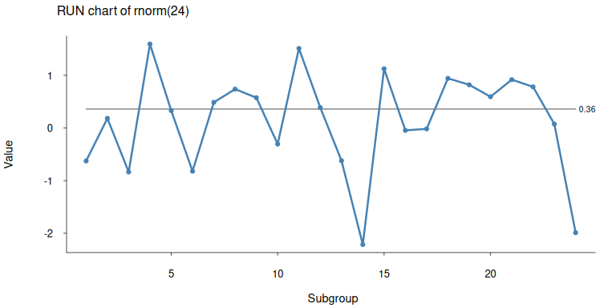

<!-- README.md is generated from README.Rmd. Please edit that file -->

# Process Behaviour Charts

<!-- badges: start -->
<!-- badges: end -->

Yet another R package

## Installation

You can install the development version of pbcharts from
[GitHub](https://github.com/) with:

``` r
devtools::install_github('anhoej/pbcharts')
```

## Example

``` r
library(pbcharts)

pbc(rnorm(24))
```


