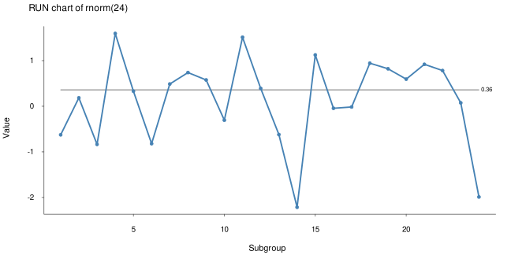
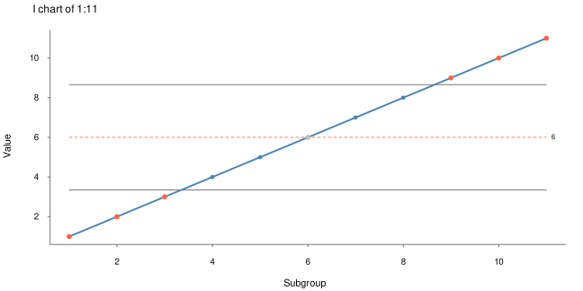
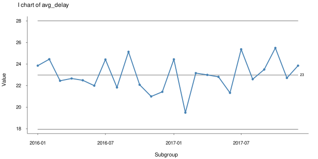
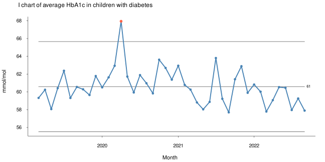
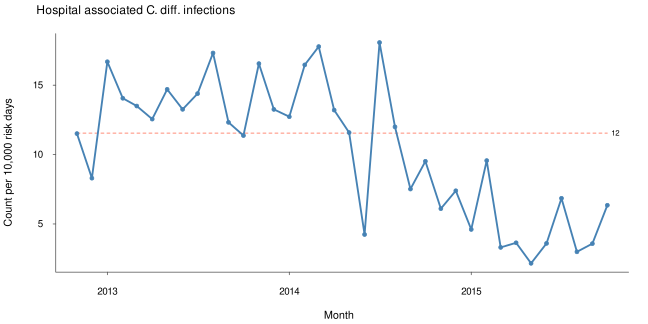

2025-06-18

<!-- README.md is generated from README.Rmd. Please edit that file -->

# Process Behaviour Charts

<!-- badges: start -->

[](https://lifecycle.r-lib.org/articles/stages.html#experimental)
<!-- badges: end -->

Run charts and individuals control charts for statistical quality
control and improvement.

`pbcharts` implements the I prime (I’ or normalised I) control chart
suggested by Taylor (2017)
<https://variation.com/normalized-individuals-control-chart/>. The I’
chart adjusts the control limits to varying subgroup sizes making
`pbcharts` useful for a wide range of measurement and count data and a
convenient replacement for the classic Shewhart control charts.

`pbcharts` uses only functions from base R making in fast and robust.

`pbcharts` is currently able to:

- facet plots (small multiples) on one categorical variable;

- freeze calculations of centre line and control limits to a baseline
  period;

- split charts into two periods;

- exclude individual data points from calculations;

- test for special cause variation using runs analysis and control
  limits;

- signal special causes using clear visual clues.

`pbcharts` is in early develpment. Please report any issues at
<https://github.com/anhoej/pbcharts/issues>

## Installation

You can install the development version of pbcharts from
[GitHub](https://github.com/anhoej/pbcharts) with:

    devtools::install_github("anhoej/pbcharts")

## Examples

Draw a run chart of 24 random normal values:

``` r
library(pbcharts)
pbc(rnorm(24))
```



Draw an individuals (I) control chart:

``` r
pbc(rnorm(24), chart = 'i')
```


Signal special causes from data points outside control limits (red
points) and(or) unusually long or few runs (red and dashed centre line):

``` r
pbc(1:11, chart = 'i')
```



Standard I chart (subgroup size = 1) of average decision to delivery
times for grade 2 caesarian sections (C-section):

``` r
pbc(month, avg_delay, 
    data  = csection, 
    chart = 'i')
```



I’ chart of C-section data taking varying subgroup sizes into account:

``` r
pbc(month, avg_delay * n, n,  # multiply numerator and denominator to keep scale
    data = csection,
    chart = 'i')
```


Faceted I’ chart of bacteremia mortality in six hospitals:

``` r
pbc(month, deaths, cases,
    facet    = hospital,                # facet plot by hospital
    data     = bacteremia_mortality,
    chart    = 'i',
    multiply = 100,                     # show percent rather than proportions
    ylim     = c(0, NA),                # suppress negative control limits
    title    = 'Bacteremia mortality',
    ylab     = '%',
    xlab     = 'Month')
```



Print a summary:

``` r
p <- pbc(month, deaths, cases, hospital,
         data  = bacteremia_mortality,
         chart = 'i',
         plot  = FALSE)

summary(p)
#>   facet part n.obs n.useful     avg_lcl        cl   avg_ucl sigma.signal
#> 1   BFH    1    24       24 -0.01152474 0.1722846 0.3560940            0
#> 2   BOH    1    23       23 -0.35972445 0.1842105 0.7281455            0
#> 3   HGH    1    24       24  0.07612754 0.2088608 0.3415940            0
#> 4   HVH    1    24       24  0.03687151 0.1912378 0.3456042            0
#> 5   NOH    1    24       24  0.03417518 0.1527016 0.2712281            0
#> 6    RH    1    24       24 -0.05822942 0.1398685 0.3379664            0
#>   runs.signal longest.run longest.run.max n.crossings n.crossings.min
#> 1           0           5               8          12               8
#> 2           0           3               8          13               7
#> 3           0           5               8          15               8
#> 4           0           4               8          15               8
#> 5           0           5               8          11               8
#> 6           0           3               8          16               8
```

Plot a pbc object:

``` r
plot(p)
```



## Procedure for calculating centre line and conrol limits

We use the following symbols:

- n = numerators
- d = denominators
- o = number of data values
- i = i<sup>th</sup> data value

Values to plot:

$$
y = \frac{n}{d}
$$

Centre line:

$$
CL = \frac{\sum{n}}{\sum{d}}
$$

Standard deviation of i<sup>th</sup> data point:

$$
s_i = \sqrt{\frac{\pi}{2}}\frac{\vert{}y_i-y_{i-1}\vert{}}{\sqrt{\frac{1}{d_i}+\frac{1}{d_{i-1}}}}
$$

Average standard deviation:

$$
\bar{s} = \frac{\sum{s}}{o}
$$

Control limits:

$$
\text{control limits} = CL \pm 3 \frac{\bar{s}}{\sqrt{d_i}}
$$
