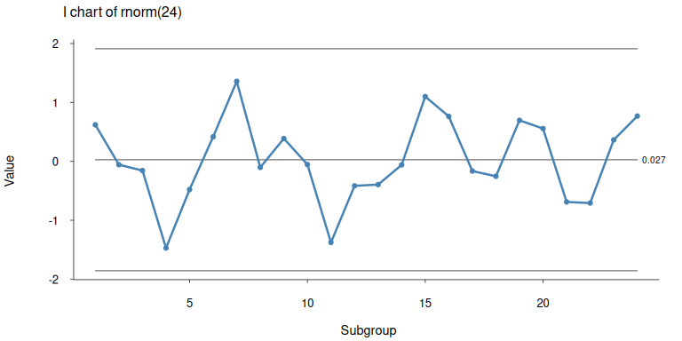
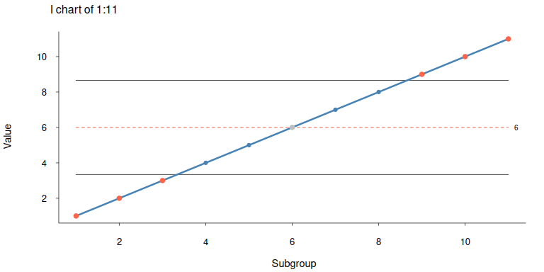
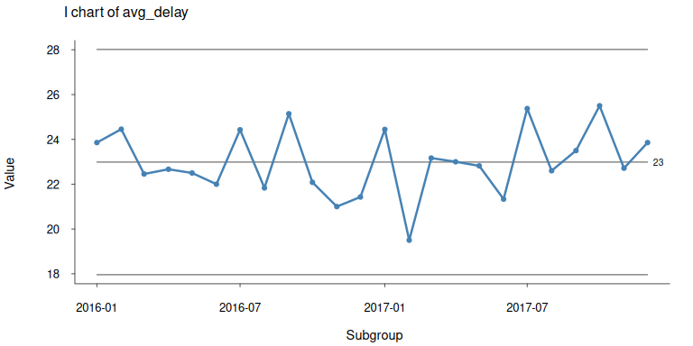
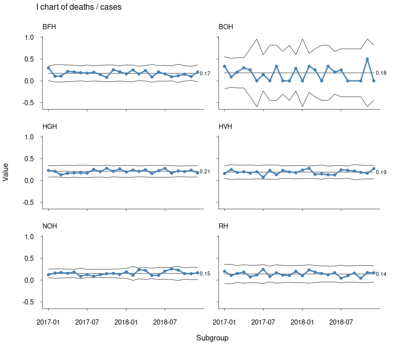

<!-- README.md is generated from README.Rmd. Please edit that file -->

# Process Behaviour Charts

<!-- badges: start -->

[](https://lifecycle.r-lib.org/articles/stages.html#experimental)
<!-- badges: end -->

Run charts and individuals control charts for statistical quality
control and improvement.

Control limits adjust to varying subgroup sizes as suggested by Taylor
(2017) <https://variation.com/normalized-individuals-control-chart/>
making `pbcharts` useful for a wide range of measurement and count data
and a convenient replacement for classic Shewhart control charts.

`pbcharts` allows for faceted plots (small multiples) on one categorical
variable.

`pbcharts` uses only functions from base R making in fast and robust.

## Installation

You can install the development version of pbcharts from
[GitHub](https://github.com/anhoej/pbcharts) with:

    devtools::install_github("anhoej/pbcharts")

## Examples

Draw a run chart of 24 random normal values:

``` r
library(pbcharts)
pbc(rnorm(24))
```


Draw an individuals (I) control chart:

``` r
pbc(rnorm(24), chart = 'i')
```



Signal special causes from data points outside control limits (red
points) and unusually long or few runs (red and dashed centre line):

``` r
pbc(1:11, chart = 'i')
```



I chart of average decision to delivery times for grade 2 caesarian
sections:

``` r
pbc(month, avg_delay, 
data  = csection, 
chart = 'i')
```



Normalised I chart (or I prime chart) of C. section data taking varying
subgroup sizes into account:

``` r
pbc(month, avg_delay * n, n,  # multiply numerator and denominator to keep scale
    data = csection,
    chart = 'i')
```


Faceted I prime chart of bacteremia mortality in six hospitals:

``` r
pbc(month, deaths, cases,
    facet    = hospital,                # facet plot by hospital
    data     = bacteremia_mortality,
    chart    = 'i',
    multiply = 100,                     # show percent rather than proportions
    ylim     = c(0, NA),                # suppress negative control limits
    title    = 'Bacteremia mortality',
    ylab     = '%',
    xlab     = 'Month')
```


Print a summary:

``` r
p <- pbc(month, deaths, cases, hospital,
         data  = bacteremia_mortality,
         chart = 'i',
         plot  = FALSE)

summary(p)
#>   facet  n n.useful freeze     avg_lcl        cl   avg_ucl sigma.signal
#> 1   BFH 24       24     NA -0.01152474 0.1722846 0.3560940            0
#> 2   BOH 23       23     NA -0.35972445 0.1842105 0.7281455            0
#> 3   HGH 24       24     NA  0.07612754 0.2088608 0.3415940            0
#> 4   HVH 24       24     NA  0.03687151 0.1912378 0.3456042            0
#> 5   NOH 24       24     NA  0.03417518 0.1527016 0.2712281            0
#> 6    RH 24       24     NA -0.05822942 0.1398685 0.3379664            0
#>   runs.signal
#> 1           0
#> 2           0
#> 3           0
#> 4           0
#> 5           0
#> 6           0
```

Plot a pbc object:

``` r
plot(p)
```


