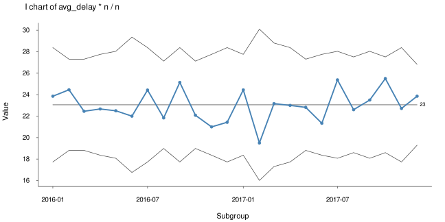
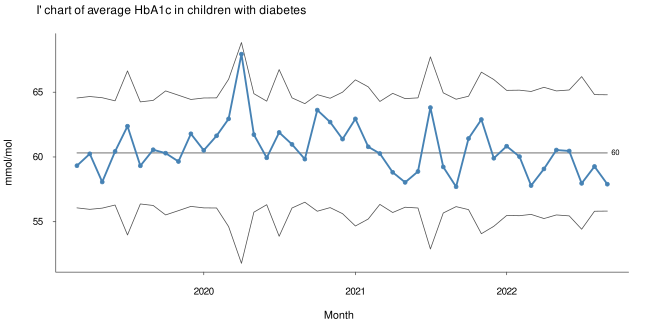
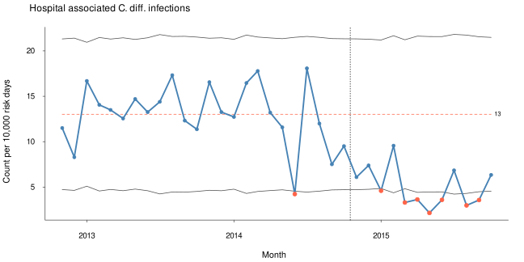
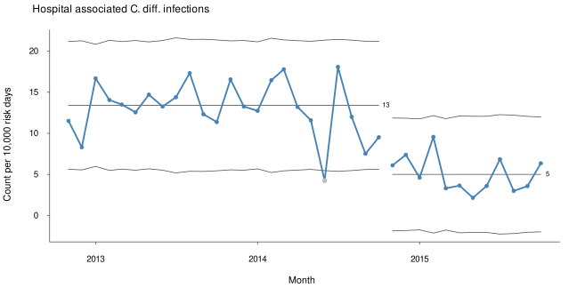

2025-11-29

- [Process Behaviour Charts](#process-behaviour-charts)
  - [Installation](#installation)
  - [Examples](#examples)
    - [Basic usage](#basic-usage)
    - [Plotting measurement data](#plotting-measurement-data)
    - [Plotting count data](#plotting-count-data)
    - [Facetted charts for multidimensional
      data](#facetted-charts-for-multidimensional-data)
    - [Structure and summary of a pbc
      object](#structure-and-summary-of-a-pbc-object)
  - [Procedure for calculating centre line and control
    limits](#procedure-for-calculating-centre-line-and-control-limits)
  - [Tests for special cause
    variation](#tests-for-special-cause-variation)

<!-- README.md is generated from README.Rmd. Please edit that file -->

# Process Behaviour Charts

– Yet another R package for statistical process control charts

<!-- badges: start -->

[](https://lifecycle.r-lib.org/articles/stages.html#experimental)
<!-- badges: end -->

An R package for run charts and individuals control charts for
statistical quality control and improvement.

pbcharts implements the I prime (I’ or normalised I) control chart
suggested by Taylor:
<https://variation.com/normalized-individuals-control-chart/>.

The I’ chart adjusts control limits to varying subgroup sizes making
pbcharts useful for a wide range of measurement and count data and a
convenient replacement for the classic Shewhart control charts.

Following the [tinyverse principles](https://www.tinyverse.org/),
pbcharts relies solely on base R functions, avoiding external package
dependencies – making it both fast and robust.

pbcharts is currently able to:

- test for special cause variation using runs analysis and control
  limits;
- signal special causes using clear visual clues;
- freeze calculations of centre line and control limits to a baseline
  period;
- split charts into separate periods;
- exclude individual data points from calculations;
- facet plots (small multiples) on one or more categorical variables.

pbcharts is in early develpment. Please report any issues at
<https://github.com/anhoej/pbcharts/issues>.

## Installation

You can install the development version of pbcharts from
[GitHub](https://github.com/anhoej/pbcharts) with:

    devtools::install_github("anhoej/pbcharts")

## Examples

### Basic usage

Draw a run chart of 24 random normal values:

``` r
library(pbcharts)  # load pbcharts

set.seed(1)        # lock random number generator

pbc(rnorm(24))     # plot run chart of 24 random normal values
```


Draw an individuals (I) control chart:

``` r
pbc(rnorm(24), chart = 'i')
```


Signal special causes from data points outside control limits (red
points) and(or) unusually long or few runs (red and dashed centre line):

``` r
pbc(1:11, chart = 'i')
```


See below for the rules applied to signal special cause variation.

### Plotting measurement data

Standard I chart (subgroup size = 1) of average decision to delivery
times for grade 2 caesarian sections (C-section):

``` r
pbc(month, avg_delay, 
    data  = csection, 
    chart = 'i')
```


I’ chart of C-section data taking varying subgroup sizes into account:

``` r
pbc(month, avg_delay * n, n,  # multiply numerator by denominator to keep scale
    data = csection,
    chart = 'i')
```



Notice that pbc() always plots the numerator divided by the denominator.
Consequently, if the numerators have already been averaged, it is
necessary to multiply the numerator by the denominator before plotting.

Standard I chart of average HbA1c in children with diabetes:

``` r
pbc(month, avg_hba1c,
    data  = hba1c,
    chart = 'i',
    title = 'I chart of average HbA1c in children with diabetes',
    ylab  = 'mmol/mol',
    xlab  = 'Month')
```


I’ chart of average HbA1c in children with diabetes using subgroups
(number of children):

``` r
pbc(month, avg_hba1c * n, n,
    data  = hba1c,
    chart = 'i',
    title = "I' chart of average HbA1c in children with diabetes",
    ylab  = 'mmol/mol',
    xlab  = 'Month')
```



### Plotting count data

Hospital infection rates:

``` r
pbc(month, n, days,
    data     = cdi,
    multiply = 10000,
    title    = 'Hospital associated C. diff. infections',
    ylab     = 'Count per 10,000 risk days',
    xlab     = 'Month')
```


Freeze calculation of centre and control lines to period before
intervention:

``` r
pbc(month, n, days,
    data     = cdi,
    chart    = 'i',
    multiply = 10000,
    freeze   = 24,
    title    = 'Hospital associated C. diff. infections',
    ylab     = 'Count per 10,000 risk days',
    xlab     = 'Month')
```



Split chart after intervention:

``` r
pbc(month, n, days,
    data     = cdi,
    chart    = 'i',
    multiply = 10000,
    split    = 24,
    title    = 'Hospital associated C. diff. infections',
    ylab     = 'Count per 10,000 risk days',
    xlab     = 'Month')
```


Ignore freak data point \#20:

``` r
pbc(month, n, days,
    data     = cdi,
    chart    = 'i',
    multiply = 10000,
    split    = 24,
    exclude  = 20,
    title    = 'Hospital associated C. diff. infections',
    ylab     = 'Count per 10,000 risk days',
    xlab     = 'Month')
```



### Facetted charts for multidimensional data

Faceted I’ chart of bacteremia mortality in six hospitals:

``` r
pbc(month, deaths, cases,
    facet    = hospital,                # facet plot by hospital
    data     = bacteremia_mortality,
    chart    = 'i',
    ypct     = TRUE,                    # show percentage rather than proportions
    title    = 'Bacteremia mortality',
    ylab     = '%',
    xlab     = 'Month')
```


Two-way faceted chart of average waiting times for 5 types of elective
surgery in 5 regions.

``` r
pbc(qrt, avg_days,
    facet = list(region, operation), # facet by region and operation
    data = waiting_times,
    title = 'Average waiting times for elective surgery',
    ylab = 'Days',
    xlab = 'Quarter')
```


### Structure and summary of a pbc object

Saving a pbc object

``` r
# save pbc object while suppressing plotting
p <- pbc(month, deaths, cases,
         facet    = hospital,
         data     = bacteremia_mortality,
         chart    = 'i',
         ypct     = TRUE,
         title    = 'Bacteremia mortality',
         ylab     = '%',
         xlab     = 'Month',
         plot     = FALSE)             # Suppress plotting

# print structure
str(p)
#> List of 11
#>  $ title  : chr "Bacteremia mortality"
#>  $ xlab   : chr "Month"
#>  $ ylab   : NULL
#>  $ ncol   : NULL
#>  $ yfixed : logi TRUE
#>  $ ypct   : logi TRUE
#>  $ freeze : NULL
#>  $ split  : NULL
#>  $ exclude: NULL
#>  $ chart  : chr "i"
#>  $ data   :'data.frame': 143 obs. of  20 variables:
#>   ..$ facet          : chr [1:143] "BFH" "BFH" "BFH" "BFH" ...
#>   ..$ part           : int [1:143] 1 1 1 1 1 1 1 1 1 1 ...
#>   ..$ x              : Date[1:143], format: "2017-01-01" "2017-02-01" ...
#>   ..$ num            : int [1:143] 19 5 5 11 11 12 9 12 8 4 ...
#>   ..$ den            : int [1:143] 64 47 46 51 54 64 51 61 55 51 ...
#>   ..$ y              : num [1:143] 0.297 0.106 0.109 0.216 0.204 ...
#>   ..$ longest.run    : int [1:143] 5 5 5 5 5 5 5 5 5 5 ...
#>   ..$ longest.run.max: num [1:143] 8 8 8 8 8 8 8 8 8 8 ...
#>   ..$ n.crossings    : num [1:143] 12 12 12 12 12 12 12 12 12 12 ...
#>   ..$ n.crossings.min: num [1:143] 8 8 8 8 8 8 8 8 8 8 ...
#>   ..$ lcl            : num [1:143] 0.00207 0 0 0 0 ...
#>   ..$ cl             : num [1:143] 0.172 0.172 0.172 0.172 0.172 ...
#>   ..$ ucl            : num [1:143] 0.342 0.371 0.373 0.363 0.358 ...
#>   ..$ runs.signal    : logi [1:143] FALSE FALSE FALSE FALSE FALSE FALSE ...
#>   ..$ sigma.signal   : logi [1:143] FALSE FALSE FALSE FALSE FALSE FALSE ...
#>   ..$ freeze         : logi [1:143] TRUE TRUE TRUE TRUE TRUE TRUE ...
#>   ..$ include        : logi [1:143] TRUE TRUE TRUE TRUE TRUE TRUE ...
#>   ..$ base           : logi [1:143] TRUE TRUE TRUE TRUE TRUE TRUE ...
#>   ..$ n.obs          : int [1:143] 24 24 24 24 24 24 24 24 24 24 ...
#>   ..$ n.useful       : int [1:143] 24 24 24 24 24 24 24 24 24 24 ...
#>  - attr(*, "class")= chr [1:2] "pbc" "list"

# extract list element
p$title
#> [1] "Bacteremia mortality"

# print summary
summary(p)
#>   facet part n.obs n.useful     avg_lcl        cl   avg_ucl sigma.signal
#> 1   BFH    1    24       24 0.001045397 0.1722846 0.3560940            0
#> 2   BOH    1    23       23 0.000000000 0.1842105 0.7281455            0
#> 3   HGH    1    24       24 0.076127536 0.2088608 0.3415940            0
#> 4   HVH    1    24       24 0.036871508 0.1912378 0.3456042            0
#> 5   NOH    1    24       24 0.034837526 0.1527016 0.2712281            0
#> 6    RH    1    24       24 0.000000000 0.1398685 0.3379664            0
#>   runs.signal longest.run longest.run.max n.crossings n.crossings.min
#> 1           0           5               8          12               8
#> 2           0           3               8          13               7
#> 3           0           5               8          15               8
#> 4           0           4               8          15               8
#> 5           0           5               8          11               8
#> 6           0           3               8          16               8

# plot chart
plot(p)
```


## Procedure for calculating centre line and control limits

We use the following symbols:

- n = numerators
- d = denominators
- o = number of data values
- i = i<sup>th</sup> data value

Values to plot:

$$
y = \frac{n}{d}
$$

Centre line:

$$
CL = \frac{\sum{n}}{\sum{d}}
$$

Standard deviation of i<sup>th</sup> data point:

$$
s_i = \sqrt{\frac{\pi}{2}}\frac{\vert{}y_i-y_{i-1}\vert{}}{\sqrt{\frac{1}{d_i}+\frac{1}{d_{i-1}}}}
$$

Average standard deviation:

$$
\bar{s} = \frac{\sum{s}}{o}
$$

Control limits:

$$
\text{control limits} = CL \pm 3 \frac{\bar{s}}{\sqrt{d_i}}
$$

## Tests for special cause variation

pbc() applies [three tests](https://doi.org/10.1186/s12874-018-0564-0)
to detect special cause variation:

- **Data points outside the control limits**<br> Any point falling
  outside the control limits indicates potential special cause
  variation.

- **Unusually long runs**<br> A run consists of one or more consecutive
  data points on the same side of the centre line. Data points that fall
  exactly on the centre line neither contribute to nor interrupt a run.
  For a random process, the upper 95% prediction limit for the longest
  run is approximately `log₂(n) + 3`, rounded to the nearest whole
  number, where n is the number of useful data points (i.e. those not on
  the centre line).

- **Unusually few crossings**\<br\< A crossing occurs when two
  consecutive data points fall on opposite sides of the centre line. In
  a random process, the number of crossings follows a binomial
  distribution. The lower 5% prediction limit can be found using the
  cumulative distribution function:
  `qbinom(p = 0.05, size = n - 1, prob = 0.5)`.

Data points outside the control limits are highlighted, and the centre
line is dashed and coloured if either of the two runs tests is positive.

In run charts, the centre line represents the median; in control charts,
it represents the (weighted) mean.

Critical values for runs and crossing:

| Number of useful observations | Upper limit for longest run | Lower limit for number of crossings |
|---:|---:|---:|
| 10 | 6 | 2 |
| 11 | 6 | 2 |
| 12 | 7 | 3 |
| 13 | 7 | 3 |
| 14 | 7 | 4 |
| 15 | 7 | 4 |
| 16 | 7 | 4 |
| 17 | 7 | 5 |
| 18 | 7 | 5 |
| 19 | 7 | 6 |
| 20 | 7 | 6 |
| 21 | 7 | 6 |
| 22 | 7 | 7 |
| 23 | 8 | 7 |
| 24 | 8 | 8 |
| 25 | 8 | 8 |
| 26 | 8 | 8 |
| 27 | 8 | 9 |
| 28 | 8 | 9 |
| 29 | 8 | 10 |
| 30 | 8 | 10 |
| 31 | 8 | 11 |
| 32 | 8 | 11 |
| 33 | 8 | 11 |
| 34 | 8 | 12 |
| 35 | 8 | 12 |
| 36 | 8 | 13 |
| 37 | 8 | 13 |
| 38 | 8 | 14 |
| 39 | 8 | 14 |
| 40 | 8 | 14 |
| 41 | 8 | 15 |
| 42 | 8 | 15 |
| 43 | 8 | 16 |
| 44 | 8 | 16 |
| 45 | 8 | 17 |
| 46 | 9 | 17 |
| 47 | 9 | 17 |
| 48 | 9 | 18 |
| 49 | 9 | 18 |
| 50 | 9 | 19 |
| 51 | 9 | 19 |
| 52 | 9 | 20 |
| 53 | 9 | 20 |
| 54 | 9 | 21 |
| 55 | 9 | 21 |
| 56 | 9 | 21 |
| 57 | 9 | 22 |
| 58 | 9 | 22 |
| 59 | 9 | 23 |
| 60 | 9 | 23 |
| 61 | 9 | 24 |
| 62 | 9 | 24 |
| 63 | 9 | 25 |
| 64 | 9 | 25 |
| 65 | 9 | 25 |
| 66 | 9 | 26 |
| 67 | 9 | 26 |
| 68 | 9 | 27 |
| 69 | 9 | 27 |
| 70 | 9 | 28 |
| 71 | 9 | 28 |
| 72 | 9 | 29 |
| 73 | 9 | 29 |
| 74 | 9 | 29 |
| 75 | 9 | 30 |
| 76 | 9 | 30 |
| 77 | 9 | 31 |
| 78 | 9 | 31 |
| 79 | 9 | 32 |
| 80 | 9 | 32 |
| 81 | 9 | 33 |
| 82 | 9 | 33 |
| 83 | 9 | 34 |
| 84 | 9 | 34 |
| 85 | 9 | 34 |
| 86 | 9 | 35 |
| 87 | 9 | 35 |
| 88 | 9 | 36 |
| 89 | 9 | 36 |
| 90 | 9 | 37 |
| 91 | 10 | 37 |
| 92 | 10 | 38 |
| 93 | 10 | 38 |
| 94 | 10 | 39 |
| 95 | 10 | 39 |
| 96 | 10 | 39 |
| 97 | 10 | 40 |
| 98 | 10 | 40 |
| 99 | 10 | 41 |
| 100 | 10 | 41 |
